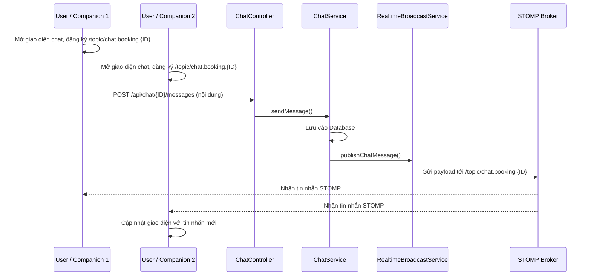
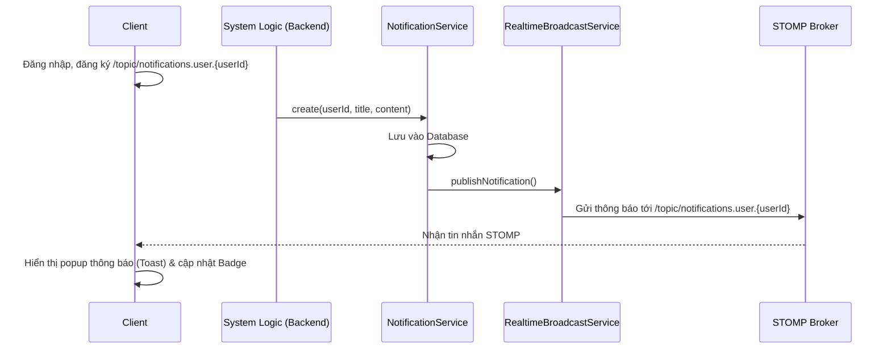

# Sơ đồ Hoạt động Tính năng Chat và Thông báo (Real-time STOMP)

Tài liệu này tổng hợp cấu trúc và luồng dữ liệu của các tính năng Chat và Thông báo giữa User và Companion trong hệ thống, dựa trên mã nguồn hiện có.

## 1. Thành phần Cốt lõi & Cấu hình WebSocket
Hệ thống sử dụng **Spring WebSockets** kết hợp với **STOMP** và **SockJS** fallback để truyền nhận tin nhắn theo thời gian thực.
- **WebSocketConfig**: Cấu hình endpoint chính tại `/ws`. Broker được định tuyến qua `/topic` để server gửi dữ liệu đến các client.
- **StompSubscribeInterceptor**: Lớp bảo mật chặn (intercept) các yêu cầu đăng ký (subscribe) để đảm bảo người dùng chỉ được lắng nghe `/topic/notifications.user.{userId}` của riêng họ và `/topic/chat.booking.{bookingId}` mà họ có quyền truy cập.
- **Client JS**: File `realtime-stomp.js` cung cấp thư viện frontend quản lý kết nối SockJS và STOMP, bao gồm các hàm `subscribeNotifications` và `subscribeChat`.

## 2. Hoạt động Tính năng Chat
Tin nhắn (Chat) hoạt động theo mô hình: Client gửi tin nhắn qua REST API, sau đó Server lưu trữ và phát (broadcast) lại qua WebSocket.

**Các Endpoint API (REST):**
- `GET /api/chat/{bookingId}/messages`: Lấy lịch sử tin nhắn của một booking.
- `POST /api/chat/{bookingId}/messages`: Gửi tin nhắn mới.
- `GET /api/chat/{bookingId}/call`: Lấy thông tin tạo cuộc gọi.

**Luồng Dữ liệu (Message Flow):**
1. User (hoặc Companion) gửi tin nhắn qua một REST `POST` request.
2. `ChatService` kiểm tra quyền truy cập, lưu tin nhắn vào cơ sở dữ liệu thông qua `ChatMessageRepository`.
3. `ChatService` gọi `RealtimeBroadcastService.publishChatMessage()` để đẩy sự kiện.
4. Payload tin nhắn được gửi (broadcast) tới STOMP channel: `/topic/chat.booking.{bookingId}`.
5. Các Client đang lắng nghe channel này sẽ nhận được tin nhắn qua WebSocket và tự động cập nhật giao diện (UI).

## 3. Hoạt động Tính năng Thông báo (Notification)
Thông báo được hệ thống tạo tự động và đẩy đến người dùng mục tiêu theo thời gian thực (Real-time).

**Các Endpoint API (REST):**
Được chia theo Role (User, Companion, Admin) quản lý trạng thái thông báo:
- `GET /api/{role}/notifications/me`: Lấy danh sách thông báo.
- `PATCH /api/{role}/notifications/{id}/read`: Đánh dấu một thông báo đã đọc.
- `PATCH /api/{role}/notifications/read-all`: Đánh dấu tất cả đã đọc.

**Luồng Dữ liệu (Message Flow):**
1. Một thao tác trong hệ thống (như thay đổi trạng thái booking) kích hoạt `NotificationService.create(userId, title, content)`.
2. Thông báo được lưu trữ vào CSDL (`NotificationRepository`).
3. Dịch vụ gọi `RealtimeBroadcastService.publishNotification()` để phát dữ liệu.
4. Tin nhắn STOMP mang payload thông báo được gửi đến `/topic/notifications.user.{userId}`.
5. `realtime-stomp.js` ở phía Client nhận thông báo và kích hoạt giao diện (ví dụ: hiển thị popup/toast, tăng số lượng badge chưa đọc).

---

## 4. Sequence Diagrams (Sơ đồ tuần tự)

### Luồng tin nhắn Chat

### Luồng thông báo (Notification)

